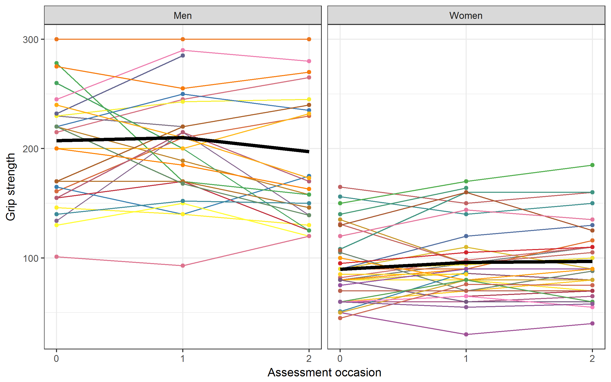

```{r, include = F}
t <- q <- 1 # Task counter
qu <- function(x = q) {
  q <<- x + 1
  return(paste0("**Question ", x, ": **"))
}
ex <- function(x = t) {
  t <<- x + 1
  return(paste0("**Exercise ", x, ": **"))
}
```

\newif\ifsol
\sol`r ifelse(solution, "true", "false")`

```{r, echo = F}
# load libraries
library(lattice)
library(ggplot2)
library(dplyr)
```

notes: there are only three "Questions" (all of them require some thinking), but 9 Exercises

packages needed: `lme4`, `arm`, `lattice` (`lattice` comes with `R`; it needs to be loaded using `library()` but there is no need to install it)


# Arthritis example revisited, part 2

Let's revisit the arthritis example from the lectures. In this study, 67 patients (29 men, 38 women) were treated for rheumatoid arthritis (Patel, 1991). To examine the effectiveness of the treatment, patients' grip strength was measured on 3 occasions. Fig. 1 (see also Lecture 2, slides 20-21) shows the individual functions, separately for male and female patients. The mean vector, the average performance for each group (bold black line), tracks "typical performance". Note that the variability of the patients' performance during the three occasions of the experiment, which is somewhat greater for the men than the women, is a salient feature of the data.



The data file "arthritis.txt" is available on LEARN. Download the file, read the file in `R` and create the data frame arth from it:

```{r}
arth <- read.table("arthritis.txt", header = TRUE)

arth.long <- reshape(
  arth, idvar = c("Subject"), varying = names(arth)[3:5], timevar = "time",
  direction = "long", times = 0:2, v.names = 'y')

summary(arth.long)
```

tells us that there are 12 missing data points, coded as `NA`, in the outcome variable `y`. This time, we will simply exclude the 12 missing values in our data.

&nbsp;

```{r}
arth.long <- arth.long[!is.na(arth.long$y), ]
```

&nbsp;

In the lecture, calculations focused on the 29 men.

```{r}
men <- arth.long[arth.long$Gender == "Men", ]
``` 

&nbsp;

In Lecture 2 and Lab 2, we specified a linear mixed-effects model with 2 \textcolor{red}{fixed effects} (intercept, slope) and 2 \textcolor{blue}{random effects} (intercept, slope). The model is a *random coefficient model* because it represents the special case that each predictor has both a fixed and random term. This is how we fit the model in `R` using `lmer`:

```{r}
library(lme4) # depends on lattice
```

`m1 <- lmer(y ~ `\textcolor{red}{\texttt{ 1 + time }}` + (`\textcolor{blue}{\texttt{ 1 + time }}` | Subject), data = men)`

```{r, echo = F}
m1 <- lmer(y ~ 1 + time + (1 + time | Subject), data = men)
```

## Where are the *p*-values for fixed-effect estimates?

```{r}
summary(m1)
```


In the fixed effects part of the `summary(m1)` output, for each fixed effect there is a *t*-value, but no longer a degrees of freedom (DF) and a *p*-value. Degrees of freedom for *t*-values are not known exactly for linear mixed-effects models. Therefore, precise *p*-values cannot be estimated (see [online update](http://www.maths.bath.ac.uk/~jjf23/ELM/mixchange.pdf) to Faraway's 2005 book for further discussion). There are a number of ways to deal with this issue:

#) In case of a large data sample and a relatively small number of fixed and random effects, the $t$ distribution is equivalent to the standard normal distribution for all practical purposes (Baayen, Davidson, & Bates, 2008, Note 1). Therefore, values of $|t| > 1.96$ indicate significance of a predictor at the $p < .05$ level, whereas effects with $|t| > 1.645$ indicate marginal significance. For the intercept in model `m1`, the *t*-value is very large, 21.191, and the intercept obviously different from zero. For the slope, measuring the effect of treatment over time, the *t*-value is very small, $-0.698$, indicating that the slope is not different from zero.

#) Another approach is to directly examine the 95% confidence intervals for the predictors from the fitted model (see Gelman & Hill, 2007, p. 261).


    Pull out the fixed-effects coefficients...
    
    ```{r}
    model1.fixef <- fixef(m1)
    ```
    
    ...and standard errors.
    
    ```{r}
    library(arm) # load convenience functions
    model1.sefixef <- se.fixef(m1)
    ```
    
    Calculate estimates $\pm1.96 \times SE$[^1]
    
    ```{r}
    model1.fixef + cbind(-1.96 * model1.sefixef, 1.96 * model1.sefixef)
    ```


    The 95% confidence interval for time is [$-12.7$; 6.0] and thus includes zero, so the fixed-effects estimate for time is not different from zero. Grip strength does not change over time.
    

#) By typing `?pvalues` into the console you can read about the `lme4` authors' take on the p value issues and about the suggestions they make.

[^1]: As a rule of thumb, Gelman and Hill (2007) recommend $\pm2 \times SE$.

&nbsp;

`r qu()`Specify a random-intercept-only models `m0` and generate confidence intervals by using the function `confint.merMod()` (see Lecture 3, slide 58).

**Tip: **set `lmer()` argument `REML = FALSE` to avoid the warning message you would see otherwise.

```{r, include = solution}
m0 <- lmer(y ~ 1 + time + (1 | Subject), data = men, REML = FALSE)
summary(m0)

confint.merMod(m0)
```

## Model predictions

When building models and choosing between different models, it can be helpful to plot the model predictions against the empirical data. The generic function `fitted()` (introduced in semester 1) returns fitted values -- the y-values that are expected for the given x-values according to the fitted model. Getting back to our example,

```{r}
men$pred <- fitted(m1)
```

extracts fitted (predicted) values from the model object `m1` and adds them to the data frame men as a new column pred (for predictions).

&nbsp;

`r qu()`Select a few subjects and plot their empirical data together with the model predictions in a trellis plot, where each panel represents data from a given subject (see slide 26, Lecture 2).

**Tip: **See slides 20-21 in Lecture 3 for a quick and dirty plot; see Lab 1 for how to randomly select subjects.

```{r, include = solution}
nrMen <- max(men$Subject) # number of men
sub_random <- sample(1:nrMen, 6) # randomly select 6 men

# there are many ways of creating the plot
# quick and dirty:
xyplot(y + pred ~ time | as.factor(Subject), data = men,
       subset = Subject %in% sub_random, scales = list(x = list(at = 0:2)))

# more sophisticated version:
xyplot(y + pred ~ time | as.factor(Subject), data = men,
       subset = Subject %in% sub_random,
       type = c("p","l"),  # empirical data as symbols, model predictions as lines
       panel = function(x, y, ...) {panel.superpose.2(x, y, ...)},
       xlab = list("Assessment Occasion"), ylab = list("Grip Strength"),
       scales = list(x = list(at = 0:2)) # ticks for x axis
)
```


## Multiple predictors and interactions

As in multiple regression analysis, linear mixed-effects models can include more than one predictor variable as fixed effect, and we can also model interactions. As with `lm()`, `A:B` specifies an interaction between predictors `A` and `B`. In principle, every fixed effect can be accompanied by a corresponding random effect. If there is no variability across groups (*e.g.,* subjects, or items), random effects can be dropped. The original data set for the arthritis and grip strength data contains data for both male and female patients. Fig. 1 suggests that men generally have larger grip strength. With regard to the development of grip strength over time, visualization of the data does not show any strikingly obvious pattern.

How can we include gender effects? First of all, we create a new variable `Gender_num` that codes gender numerically. The women serve as reference group (0) for the gender comparison.

```{r}
arth.long$Gender_num <- 0
arth.long[arth.long$Gender == "Men", "Gender_num"] <- 1 # code men with 1
```

For practice, we specify a same-intercept, different-slope model, *i.e.,* we postulate a fixed-effects structure where men and women have the same intercept but different slopes. (Looking at Fig. 1, this is not a sensible model.) We use the same randomeffects specification as in model `m1`.

```{r}
m2 <- lmer(y ~ 1 + time + Gender_num:time + (1 + time | Subject),
           data = arth.long, na.action = na.exclude)
```


It is important to note that we model the effect of gender through an interaction in the fixed-effects structure. `Gender_num:time` is equivalent to asking "how does the *slope for men differ from that for women*?" (see slide 32 in Lecture 3 for the "adopted children example").

&nbsp;

`r qu()`Specify and check more appropriate models, *i.e.,* a different-intercept, same-slope model (model `m3`), and/or a different-intercept, different-slope model (model `m4`).


```{r, include = solution}
### ANSWER ###

# This is similar to the same-intercept, different-slope model for
# the adoption data (boys vs girls) that was introduced in Lecture 3.

m3 <- lmer(y ~ 1 + time + Gender_num + (1 + time | Subject),
           data = arth.long, na.action = na.exclude)
m4 <- lmer(y ~ 1 + time + Gender_num + Gender_num:time +
             (1 + time | Subject), data = arth.long, na.action = na.exclude)
```


## Model comparison

How well does a given model fit the data? There are a number of functions that provide fit statistics for a given model (Lecture 3, slide 59): Try them out and look up the help files (*e.g.,* by typing `?logLik` into the console):

```{r, include = solution}
### ANSWER ###

logLik(m1)
deviance(m1, REML = FALSE)
REMLcrit(m1)
AIC(m1)
BIC(m1)
```

&nbsp;

When specifying several possible models we would like to know which model fits the data best. As with multiple regression analysis we can compare models using the generic `anova()` function, calling `anova(model1, model2)`. The model with the lower AIC is better and *more parsimonious*.

Note that the models need to be fit to the same data. Model `m1` was fit to the arthritis and grip strength data for men only, while model `m2` was fit to the complete data set.

```{r, message = T, error = T}
anova(m1, m2)
```

However, models 2 and 3 (Question 3) were both fit to the data set for the men.

```{r}
anova(m2, m3)
```

Model `m3` has a lower AIC than model `m2`, and the difference is significant.


# Exercises: fertility and climate

The exercises are based on the fertility and climate data that were introduced in Lab 1 in.

*Background: *Countries have been going through a shift to lower fertility, referred to as the demographic transition. This change in fertility has come along with changes in economies and rising standards of living. However, is it possible that differences in climate explain differences in fertility?

In Lab 1, we used the file "fert-trends.csv", where data were arranged in wide format. This week, we will use the file "fert-climate.csv" where data are arranged in long format. Download the data from LEARN, read them in and assign them to data frame `Fert`:

```{r}
Fert <- read.csv("fert-climate.csv")
```

The data have the following variables:

- `ISO`, `Country`: ISO code and country name.

- `continent`, `latitude`: location of the country and distance from the equator

- `ecozone`: one of 6 ecozones that divide the world in terms of ecosystems and climate

- `fertility`: average number of births per woman

- `log.gdp`: The natural logarithm of gross domestic product

- `period`: year of observation


&nbsp;

`r ex()`Positive and negative values of latitude indicate points north and south of the creator. Create a new variable to represent the absolute distance from the equator, using `abs()` on `latitude`.

```{r, include = solution}
### ANSWER ###

# Create a new variable for absolute value from the equator
Fert$abs.lat <- abs(Fert$latitude)
```

&nbsp;

`r ex()`Use `xyplot()` or another suitable graphing function to visualize the change in fertility over time in each country.


```{r, include = solution}
### ANSWER ###

xyplot(fertility ~ period | Country, data = Fert)
```

&nbsp;

`r ex()`Devise a set of coding variables, using either `continent` or `ecozone`, to test hypotheses about regional or climatic differences in fertility.


```{r, include = solution}
### ANSWER ###

# There are many possibilities here. The most straightforward to
# create dummy or effects codes for each zone:

Fert$afrotropic <- 0
Fert$afrotropic[Fert$ecozone == 'Afrotropic'] <- 1
Fert$indomalaya <- 0
Fert$indomalaya[Fert$ecozone == 'Indo-Malaya'] <- 1
Fert$nearctic <- 0
Fert$nearctic[Fert$ecozone == 'Nearctic'] <- 1
Fert$neotropic <- 0
Fert$neotropic[Fert$ecozone == 'Neotropic'] <- 1
Fert$oceania <- 0
Fert$oceania[Fert$ecozone == 'Oceania'] <- 1

# However, we might also be interested in testing particular
# properties of each region, for example: new vs old world:

Fert$world <- -1 # old world
Fert$world[Fert$ecozone %in% c('Neotropic', 'Nearctic')] <- 1

# new world tropical vs temperate (near or far from the equator):
Fert$equator <- -1 # Nearctic, Palearctic, Oceania
Fert$equator[Fert$ecozone %in% c('Afrotropic', 'Neotropic', 'Indo-Malaya')] <- 1

# Note that it is not necessary to code every region uniquely to test these hypotheses.
```

&nbsp;

`r ex()`Predict fertility from your coding variables using a complete-pooling model (that is, use `lm()` to ignore repeated observations of each country). What differences did you detect?

```{r, include = solution}
### ANSWER ###
  
lm1 <- lm(fertility ~ 1 + world + equator, data = Fert)
display(lm1, detail = TRUE)
```

```{r, echo = F}
coefs <- round(summary(lm1)$coef[2:3, 1:2], 2)
```

\ifsol
So what does the model summary tell us?

- Old world has higher fertility ($b = `r coefs[1, 1]`; SE = `r coefs[1, 2]`$)

- Countries near the equator have higher fertility ($b = `r coefs[2, 1]`; SE = `r coefs[2, 2]`$)

\fi


&nbsp;

`r ex()`Fit a second complete-pooling model but add `log(GDP)` as a predictor. How does it compare to the previous model?

```{r, include = solution}
### ANSWER ###

lm2 <- lm(fertility ~ log.gdp + world + equator, data = Fert)
display(lm2, detail = TRUE)
# the old/new world variable is no longer significant after controlling for GDP

anova(lm1, lm2)
# the second model is better (p < 0.001)
```

&nbsp;

`r ex()`Fit a constant slope (using `period`) and varying-intercepts (for each `country`) model. Include your coded variables and control for GDP.

```{r, include = solution}
### ANSWER ###

mm1 <- lmer(fertility ~ 1 + period + log.gdp + world +
              equator + (1 | Country), data = Fert)
display(mm1, detail = TRUE)
# Tropic vs temperate is still significant, but general
# secular trends accounts for a lot of change in fertility.
```

&nbsp;

`r ex()`Visualize the fit of your model.

```{r, include = solution}
### ANSWER ###

xyplot(fertility + fitted(mm1) ~ period | Country, data = Fert)
```

&nbsp;

`r ex()`What is the 95% confidence interval for the effect of `period` on `fertility`?

```{r, include = solution}
### ANSWER ###

fixef(mm1)['period'] + c(-1.96, 1.96) * se.fixef(mm1)['period']
```

&nbsp;

`r ex()`Create a series of 2 or 3 more models that add either constant or varying predictors. Compare them using AIC to choose the best model.

**Tip: **If you are getting warning messages about model convergence, try centering `period` (look up the `scale()` function to see how that's done).

```{r, include = solution}
### ANSWER ###

Fert$period <- scale(Fert$period, scale = F)
# varying-slope model:
mm2 <- lmer(fertility ~ 1 + period + log.gdp + world +
              equator + (1 + period | Country), data = Fert)

display(mm2)
```

\ifsol

This model is a lot better (AIC = `r round(AIC(mm2), 1)` vs `r round(AIC(mm1), 1)` for `mm1`)

Note that, after fitting a slope for each country, we can better detect the effect of GDP on fertility (the standard error has gotten smaller).

\fi

```{r, include = solution}
# distance from the equator:
mm3 <- lmer(fertility ~ 1 + period + log.gdp + abs.lat +
              world + equator + (1 + period | Country), data = Fert)

display(mm3)
```

\ifsol

This does not improve the model fit. Most likely, the equator variable is already doing the work.

\fi

```{r, include = solution}
# You might also try varying slopes for your coded variables:
mm4 <- lmer(fertility ~ 1 + period + log.gdp + abs.lat + world:period +
              equator:period + (1 + period | Country), data = Fert)
```


# References

Baayen, R. H., Davidson, D. J., & Bates, D. M. (2008). Mixed-effects modeling with crossed random effects

> for subjects and items. *Journal of Memory and Language, 59*(4), 390-412.

> doi:10.1016/j.jml.2007.12.005

Faraway, J. (2005). *Extending the Linear Model with R*. Boca Raton: Chapman & Hall/CRC Texts.

Patel, H. I. (1991). Analysis of incomplete data from a clinical trial with repeated measurements.

> *Biometrika, 78*(3), 609-619.

