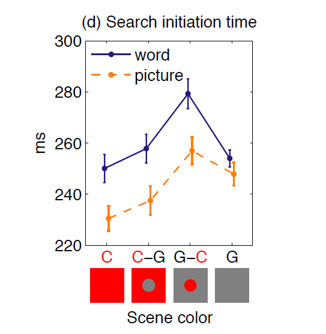
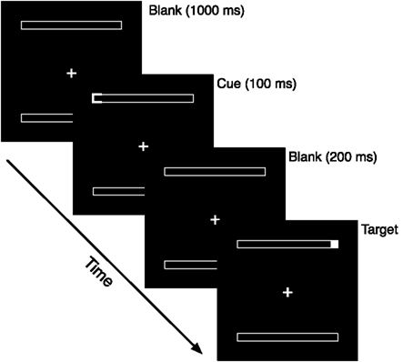

```{r, include = F}
t <- q <- 1 # Task counter
qu <- function(x = q) {
  q <<- x + 1
  return(paste0("**Question ", x, ": **"))
}
ex <- function(x = t) {
  t <<- x + 1
  return(paste0("**Exercise ", x, ": **"))
}
```

\newif\ifsol
\sol`r ifelse(solution, "true", "false")`

```{r, echo = F}
# load libraries
library(arm)
library(ez)
library(lattice)
library(lme4)
library(MASS)
library(reshape)
```

packages needed: `reshape`, `ez`, `lme4`, `MASS` (gets loaded along with `lme4`), `arm`, `lattice` (`lattice` comes with `R`; it needs to be loaded using `library()` but there is no need to install it)

In Lecture 5 we analysed data from a visual search experiment, which has a $4\times2$ repeated-measures factorial design (Nuthmann & Malcolm, 2016). The article, published open access [(link)](http://dx.doi.org/10.1167/16.2.3), reports analyses that used linear mixed models for various dependent variables.

In the lecture, we analysed the behavioural reaction times, *i.e.,* search times. We first performed a F1 (by subject) and F2 (by item) analysis of variance (ANOVA). We then replaced the two ANOVAs with a linear mixed model (LMM) in which both subjects and items can be considered as (crossed) random effects simultaneously within a single model.

# Repeated-measures factorial design: ANOVA vs. LMM

```{r}
# Load data from object-in-scene search experiment
tab <- read.table("CDEGS_LMMteaching.txt",
                  header = T, sep="\t", stringsAsFactors = F)
```

Coding of relevant columns in the data frame 'tab':

 - `SUBJECT`: subject number
 
 - `SCENE`: scene number
 
 - `Scene`: scene labels
 
 - `COLOR`: scene colour (4-level factor)

 - `CUE`: search cue (2-level factor: `1 = word`, `2 = picture`
 
 - `RT`: reaction (search) time in ms (continuous variable)

 - `SEARCH_INIT`: search initiation time (first part of search time, see below)

 - `HIT_GLMM`: search success (binary variable: `1 = hit`, `0 = miss`)

In the article, participants' eye-movement data were used to decompose the behavioural button-press search time into three behavioural epochs:

> Search time = initiation time + scanning time + verification time

> `RT` = `SEARCH_INIT` + `SCAN` + `VERI` (using the variable names in the data frame)

A visualization of this decomposition is available [here](http://jov.arvojournals.org/data/Journals/JOV/933556/jov-9-11-8-fig001.jpeg). In the first part of this lab, we follow the lecture by performing ANOVA and LMM analyses, but this time with a different dependent variable. Specifically, we will replace 'reaction time' with 'search initiation time'. Defined as the elapsed time between onset of the search scene and the first eye movement, it simply measures the time needed to begin search. As in the lecture (see slide 15), we only analyse correct (valid) trials in which participants found the target ("hits" in GLMM analyses below).

```{r}
# index valid data
idx_valid_rt <- which(tab$HIT_GLMM == 1)
```

&nbsp;

`r qu()`Create a new data frame 'tabv' with valid data only.

```{r, include = solution}
### ANSWER ###

tabv <- tab[idx_valid_rt, ]
```

&nbsp;

## ANOVA (F1) of search initiation times

*(Skip this section if you are not interested in ANOVA)*

In the subjects analysis, or F1, condition means are obtained for each subject and submitted to an ANOVA. In the items analysis, or F2, condition means are obtained for each item and also submitted to an ANOVA. To perform the ANOVA, we first need to average the data. Here, we obtain condition means for each subject to perform an F1 ANOVA.

```{r}
# means per subject
tabv.m <- melt(tabv, id.var=c("CUE", "COLOR", "SUBJECT"),
               measure.var = "SEARCH_INIT", na.rm = T)
# 256 rows for 32 subjects x 8 conditions
init_mean_sub <- cast(tabv.m, SUBJECT+CUE+COLOR~variable, mean)
```

&nbsp;

In the lecture, we used the `ezANOVA()` function from the `ez` package to perform a two-way repeated measures ANOVA. Here is the general formula (see slide 21):

```{r, eval = F}
newModel = ezANOVA(
  data = dataFrame, dv = .(outcome variable),
  wid = .(variable that identifies participants),
  within = .(repeated measures predictors),
  type = 2, detailed = FALSE)
```

&nbsp;

`r qu()`Perform a two-way repeated measures ANOVA on search initiation times.

**Tip: **The vectors passed to the `wid` and `within` arguments of `ezANOVA()` must be of class `factor`.

```{r, include = solution}
### ANSWER ###

init_mean_sub$SUBJECT <- as.factor(init_mean_sub$SUBJECT)
init_mean_sub$CUE <- as.factor(init_mean_sub$CUE)
init_mean_sub$COLOR <- as.factor(init_mean_sub$COLOR)
newModel = ezANOVA(data = init_mean_sub, dv = .(SEARCH_INIT),
                   wid = .(SUBJECT),
                   within = .(CUE, COLOR), type = 3, # emulate the approach taken by SPSS
                   detailed = TRUE)
print(newModel)
```

&nbsp;

`r qu()`Is the assumption of sphericity met?

**Tip: **Revisit slides 23-35 from lecture 5.

\ifsol
```{r, include = solution}
### ANSWER ###
```

Yes, the assumption of sphericity is met because Mauchly's test statistic is nonsignificant: $p = 0.29$ for `COLOR` and $p = 0.07$ for `CUE:COLOR` interaction. Non-significance means that the variances of the differences between conditions are equal.

\fi

&nbsp;

`r qu()`For the two main effects and their interaction, retrieve the relevant numbers for the degree of freedoms, the *F* values, and the *p*-values from the `ezANOVA()` output. That is, replace the '?'s below with the correct numbers.

\ifsol
```{r, include = solution}
### ANSWER ###
```

 - main effect of cue type: $F(1, 31) = 12.52,\ p < .001$

 - main effect of scene colour: $F(3, 93) = 9.09,\ p < .001$

 - interaction cue type × scene colour: $F(3, 93) = 1.11,\ p = .347$

> Notes on output:

> - `n` is numerator

> - `d` is denominator

> - `DF` is degrees of freedom

> - `SS` is sums of squares, with `SSn` = *model* sum of squares, `SSd` = *residual* sum of squares (error)

> - `F` = ratio of systematic variance to unsystematic variance equal to $$\frac{SS_n/df_n}{SS_d/df_d}$$

> - `ges` is Generalised Eta-Squared ($\hat\eta_G^2$) measure of effect size

\else

- main effect of cue type: $F(?, ??) = ??.??, p < .???$

- main effect of scene colour: $F(?, ??) = ??.??, p < .???$

- interaction cue type × scene colour: $F(?, ??) = ?.??, p < .???$

\fi

&nbsp;

To help you interpret the ANOVA results, Figure 1 (Figure 2d in Nuthmann & Malcolm, 2016) displays the mean search initiation times for the different experimental conditions.



In the present experiment, the different scene items constitute a second random factor. Therefore, we could complement the F1 (subject) ANOVA with a F2 (item) ANOVA. However, neither analysis is truly an appropriate description of all sources of systematic variance within the outcome variable (Locker, Hoffman, & Bovaird, 2007).

## LMM

A better alternative is to replace the F1-ANOVA and F2-ANOVA with a single linear mixed model. Accordingly, we will now analyse the search initiation time data with linear mixed models. LMMs are regression techniques and experimental design factors therefore enter the model as contrasts. For contrast coding, we will use the terminology and example code by the UCLA Statistical Consulting Group (2011; [link](http://www.ats.ucla.edu/stat/r/library/contrast_coding.htm)).

In the article by Nuthmann & Malcolm (2016), the contrast coding for search initiation times is described as follows:

 > "In the present study, we used simple coding to test for effects of scene color (reference: full color) and cue specificity (reference: word cues) on search initiation times. The intercept in the color-cue model reflects the grand mean, *i.e.,* the mean of the eight cell means." (p. 8)

&nbsp;

We will now implement this contrast coding. The code for the 2-level factor `cue` is as follows (see slide 39):

```{r}
tabv$CUE_SIMPLE <- as.factor(tabv$CUE) # cue: 1 word cue, 2 picture cue
contrasts(tabv$CUE_SIMPLE) <- contr.treatment(2) - 0.5 # -0.5 vs. 0.5
```

&nbsp;

`r qu()`Implement simple coding for the 4-level factor `colour`. A solution can be found [here](https://stats.idre.ucla.edu/r/library/r-library-contrast-coding-systems-for-categorical-variables/#SIMPLE), where a 4-level factor `race` is considered. Look for the code that creates `my.simple` and copy it into your own `R` script.

```{r, include = solution}
### ANSWER ###

# creating the contrast matrix manually by modifying the dummy coding scheme
c <- contr.treatment(4)
my.coding <- matrix(rep(1/4, 12), ncol = 3)
my.simple <- c-my.coding
```

&nbsp;

Then, we create a new factor variable `COLOR_SIMPLE` and assign the matrix for the simple contrast to it:
```{r}
tabv$COLOR_SIMPLE <- as.factor(tabv$COLOR)
contrasts(tabv$COLOR_SIMPLE) <- my.simple
```

&nbsp;

Now that we have defined contrasts for our experimental design factors, we are ready to build linear mixed models. Regarding the random effects, we will start with a simple structure, which includes random intercepts for subjects and items only.

&nbsp;

`r qu()`Write down how this **random**-effects structure looks like in `R` code.

```{r, include = solution, eval = F}
### ANSWER ###

(1 | SUBJECT) + (1 | SCENE)
```

&nbsp;

The fixed-effects structure follows the ANOVA logic: main (or simple) effect of `COLOR`, main effect of `CUE`, `COLOR`$\times$`CUE` interaction.

&nbsp;

`r qu()`Write down how this **fixed**-effects structure looks like in `R` code.

**Tip: **Remember that you need to use the variables in the data frame that represent the contrasts (simple coding) that we defined above.

```{r, include = solution, eval = F}
### ANSWER ###

1 + COLOR_SIMPLE + CUE_SIMPLE + COLOR_SIMPLE:CUE_SIMPLE

# or, in short
COLOR_SIMPLE * CUE_SIMPLE
```

&nbsp;

`r qu()`Specify a linear mixed model in `R`, which includes the fixed effects and random effects from above. Call this model `m.full.int`.

```{r, include = solution}
### ANSWER ###

m.full.int <- lmer(SEARCH_INIT ~ 1 + COLOR_SIMPLE + CUE_SIMPLE +
                     COLOR_SIMPLE:CUE_SIMPLE + (1 | SUBJECT) +
                     (1 | SCENE), data = tabv, REML = F)
```

&nbsp;

`r qu()`The fixed-effects table as part of the model output should list eight coefficients and their associated standard errors and *t*-values. Go through them one by one and write down what each of them means.

**Tip: **The following code will retrieve the fixed-effects table from the model output: 
```{r}
print(coef(summary(m.full.int)), digits = 2)
```

\ifsol

#. `(Intercept)`: reflects grand mean (the mean of the eight cell means)

#. `COLOR_SIMPLE2`: condition 2 minus condition 1 (C-G$-$C)

#. `COLOR_SIMPLE3`: condition 3 minus condition 1 (G-C$-$C)

#. `COLOR_SIMPLE4`: condition 4 minus condition 1 (G$-$C)

#. `CUE_SIMPLE2`: condition 2 minus condition 1 (Picture$-$Word) = facilitatory effect of having a picture cue

#. `COLOR_SIMPLE2:CUE_SIMPLE2`: Does the `CUE` effect differ for `COLOR` condition 2? (no)

#. `COLOR_SIMPLE3:CUE_SIMPLE2`: Does the `CUE` effect differ for `COLOR` condition 3? (no)

#. `COLOR_SIMPLE4:CUE_SIMPLE2`: Does the `CUE` effect differ for `COLOR` condition 4? (no)

\fi

&nbsp;

In the lecture, we discussed that we can get the closest equivalent to the so-called omnibus test that the ANOVA would provide by using incremental model building and model comparison to test whether fixed effects and their interactions have significant effects (see slides 43-45; 49). In this framework, our model `m.full.int` corresponds to model `mFull` = `mColorCueInteraction`.

&nbsp;

`r qu()`Build the other three models and run the model comparisons. What are your conclusions with regards to the effects of colour and cue and their interaction?

**Tip: **Revisit slides 44 and 45:

> `anova(mA, mFull)`: if `mFull` provides better fit than `mA`, then B has an effect (main effect or interaction)

> `anova(mB, mFull)`: if `mFull` provides better fit than `mB`, then A has an effect (main effect or interaction)

> `anova(mAB, mFull)`: if `mFull` provides better fit than `mAB`, then there is a significant interaction between A and B


```{r, include = solution}
### ANSWER ###

m.AB.int <- lmer(SEARCH_INIT ~ 1 + COLOR_SIMPLE + CUE_SIMPLE +
                   (1 | SUBJECT) + (1 | SCENE), data = tabv, REML = F)

m.A.int <- lmer(SEARCH_INIT ~ 1 + COLOR_SIMPLE + (1 | SUBJECT) +
                  (1 | SCENE), data = tabv, REML = F)

m.B.int <- lmer(SEARCH_INIT ~ 1 + CUE_SIMPLE + (1 | SUBJECT) +
                  (1 | SCENE), data = tabv, REML = F)

anova(m.A.int, m.full.int) # CUE has an effect
anova(m.B.int, m.full.int) # COLOR has an effect
anova(m.AB.int, m.full.int) # interaction not needed
```

&nbsp;

By now you should be objecting: Yes, but these models have random intercepts only. What about models that have the maximal random-effects structure justified by the design? The paper reports the color--cue model, for which the model specification with 'maximal' random effects looks as follows:

```{r, eval = F}
lmer(SEARCH_INIT ~ 1 + COLOR_SIMPLE + CUE_SIMPLE + (1 + COLOR_SIMPLE + CUE_SIMPLE | SUBJECT) +
       (1 + COLOR_SIMPLE + CUE_SIMPLE | SCENE), data = tabv, REML = F)
```

&nbsp;

It requires estimating 30 variance components and correlation parameters for the variance-covariance matrix of the random effects (see slide 48), which is too big a job for our small data set. Thus, the model did not converge. You can try running this model, but be aware that it will take close to 2 min (on a good computer) to finish with a convergence warning.

One way to simplify the random-effects structure is to look for small variances and small correlations in the random-effects part of the model output for the intractable model `m.AB.max`. Here, an obvious candidate is the by-item random slope for `CUE`.

&nbsp;

`r qu()`Remove this random variance (and thereby also the associated correlation parameters) from the model formula. Call the new model `m.AB.paper` and run it.

```{r, include = solution}
### ANSWER ###

m.AB.paper <- lmer(SEARCH_INIT ~ 1 + COLOR_SIMPLE + CUE_SIMPLE +
                     (1 + COLOR_SIMPLE + CUE_SIMPLE | SUBJECT) +
                     (1 + COLOR_SIMPLE | SCENE), data = tabv, REML = F)
```

&nbsp;

`r qu()`This question concerns the variance-covariance matrix of the random effects of this final model. How many variance components and correlation parameters are there?

\ifsol
```{r, include = solution}
### ANSWER ###
```

Twenty-five!

You can simply count them in model output under `Random effects`, or use the command:
```{r}
print(m.AB.paper@devcomp$dims[["nth"]])
```

Or, for a by-hand calculation, use the equation: $n\times(n+1)/2$, with $n$ = number of variance components related to a random factor (see lecture 4, slide 41):

- by-subject parameters: $5*6/2 = 15$

- by-item: $4*5/2 = 10$

- total correlation parameters: $15 + 10 = 25$

\fi

&nbsp;

`r qu()`Based on the results for the fixed effects for this final model, fill in the correct numbers (replace the '?'s below) in the results section in Nuthmann and Malcolm (2016), p. 8:

\ifsol

> "The intercept in the color-cue model reflects the grand mean, *i.e.,* the mean of the eight cell means ($b = 251.7$ ms, $SE = 8.9$, $t = 28.34$). Independent of the color manipulation, search initiation was facilitated if search was guided by a picture cue rather than a word cue ($b = -17.4$ ms, $SE = 4.9$, $t = -3.55$). There was no significant difference in mean search initiation time between the full-color condition and the condition in which color was removed from central vision (\textcolor{red}{C}-G$-$\textcolor{red}{C}: $b = 7.5$ ms, $SE = 6.5$, $t = 1.15$). However, it took longer to initiate search when color was removed from peripheral vision (G-\textcolor{red}{C}$-$\textcolor{red}{C}: $b = 27.4$ ms, $SE = 6.6$, $t = 4.17$). Search initiation times did not differ significantly for color and grayscale scenes (G$-$\textcolor{red}{C}: $b = 10.4$ ms, $SE = 5.8$, $t = 1.78$)."

\else

> "The intercept in the color-cue model reflects the grand mean, *i.e.,* the mean of the eight cell means ($b = ???.?$ ms, $SE = ?.?$, $t = ??.??$). Independent of the color manipulation, search initiation was facilitated if search was guided by a picture cue rather than a word cue ($b = -??.?$ ms, $SE = ?.?$, $t = -?.??$). There was no significant difference in mean search initiation time between the full-color condition and the condition in which color was removed from central vision (\textcolor{red}{C}-G$-$\textcolor{red}{C}: $b = ?.?$ ms, $SE = ?.?$, $t = ?.??$). However, it took longer to initiate search when color was removed from peripheral vision (G-\textcolor{red}{C}$-$\textcolor{red}{C}: $b = ??.?$ ms, $SE = ?.?$, $t = ?.??$). Search initiation times did not differ significantly for color and grayscale scenes (G$-$\textcolor{red}{C}: $b = ?.??$ ms, $SE = ?.?$, $t = ?.??$)."

\fi

&nbsp;

# GLMM

Linear mixed models (LMM) have been extended to *generalised* LMM and can hence be used efficiently to model binary response data (*e.g.,* Jaeger, 2008).

## Intercept only model
Search success is a binary variable-for a given observer and image the target was either found (1) or not (0). Such data can be analysed with a binomial GLMM with a logit link function. In such a model, parameter estimates are obtained on the log-odds or logit scale.

Searching for a cued object in a picture of a real-world scene is an easy task.

Nuthmann & Malcolm (2016) report on p. 7:

> "To assess global search accuracy we report a binomial GLMM that included the intercept as fixed effect and by-subject and by-item random intercepts. Converting the parameter estimate for the intercept ($b = 3.2, SE = 0.18, z = 18.15, p < .001$) back from the log-odds scale to a probability reveals that the probability of correctly locating and identifying the target was very high at 0.96. Being at ceiling, search accuracy was neither modulated by scene color nor by cue specificity."

&nbsp;

`r qu()`Build such an intercept only model.

**Tip: **This will be a much stripped down version of the model `gm.full.int` in slide 57 in Lecture 5.

```{r, include = solution}
### ANSWER ###

gmSubjItemIntercept <- glmer(HIT_GLMM ~ 1 + (1 | SUBJECT) + (1 | SCENE),
                             data = tab, family = "binomial")
```

&nbsp;

`r qu()`According to this model, is there variability in the intercept between subjects?

**Tip: **Look for the relevant variance parameter in the model summary output and produce a caterpillar plot (using `dotplot()` from package `lattice`).

```{r, include = solution}
### ANSWER ###

# There is relatively little variability in overall search accuracy between subjects.

print(dotplot(ranef(gmSubjItemIntercept, condVar = T))[['SUBJECT']])
# note: could also do model comparison (drop the by-subject intercept)
```

&nbsp;

`r qu()`Which scene has the lowest search accuracy?

Tip:

- The model output will tell you (`ranef()`/`coef()` functions or caterpillar plot)

- If you have identified the scene number, you can find the scene label in data frame `tab` using indexing

```{r, include = solution}
### ANSWER ###

# straightforward solution:

print(dotplot(ranef(gmSubjItemIntercept, condVar = T))[['SCENE']])
unique(tab[tab$SCENE == 24, "Scene"])
which(ranef(gmSubjItemIntercept)[['SCENE']] == min(ranef(gmSubjItemIntercept)[['SCENE']]))

# OR:
which(coef(gmSubjItemIntercept)[['SCENE']] == min(coef(gmSubjItemIntercept)[['SCENE']]))
unique(tab[tab$SCENE == 24, "Scene"])

# more elegant solution: use scene label as random effect
tab$Scene <- as.factor(tab$Scene)
gmSubjItemIntercept2 <- glmer(HIT_GLMM ~ 1 + (1 | SUBJECT) + (1 | Scene),
                              data = tab, family = "binomial")
print(dotplot(ranef(gmSubjItemIntercept2, condVar = T))[['Scene']])
```

&nbsp;

# Exercises

Kliegl *et al.* (2011) published a paper in which they demonstrated how to assess experimental effects and individual differences in linear mixed models. To this end, they carried out a classic experiment of visual attention: the two-rectangle cueing paradigm (Egly, Driver, & Rafal, 1994). Attentional selection of visual information has been conceptualized as *space-based*, as *object-based*, and as being due to an *attraction* back to the original fixation location. The experiment conducted by Kliegl *et al.* replicates these effects with reaction-time differences between four experimental conditions.

In the two-rectangle cueing paradigm, participants are presented with two parallel rectangles. Their task is to detect as quickly as possible a target flash, which appears at one end of a rectangle, see Figure 2 for an illustration. Critically, before the target is presented there is an informative cue presented at one of the four ends of the rectangles. Most of the times, the cue correctly indicates which rectangle end would be the target (condition 1 'val': 'valid'). Some of the times, the cue appears on the wrong end of the rectangle (condition 2 'sod': 'same object, different location'), on the same end of the other rectangle (condition 3 'dos': 'different object, same distance'), or on the opposite corner (condition 4 'dod': 'different object, diagonal location'). For analysis of reaction times, the four different conditions were contrast coded using "backward difference coding" (see slides 40 and 41 in lecture 5) to study:

- *spatial* effect (`c1`): cue at opposite end of the rectangle vs. valid cue (sod - val).

- *object* effect (`c2`): same-object advantage vs. different object disadvantage (dos - sod).

- *attention* effect (`c3`): attention wandering back to the fixation location accelerates movement of attention to the opposite corner (dos - dod)[^1].

[^1]:Note that this contrast was inverted from "dod - dos" (difference between conditions 4 and 3) to "dos - dod" (difference between conditions 3 and 4).



Start by reading in the data:

```{r}
# Read in attention data
Attention <- read.csv("KWDYZ.FQPM.csv")
head(Attention)
```

&nbsp;

The reaction time outcome variable is `rt`. Subjects are coded as `id`. The levels of factor `tar` code the four conditions: *val*, *sod*, *dos*, *dod*. The contrast variables are `c1`, `c2`, and `c3`. Note that the three different contrasts are defined as vectors in three different variables; it allows for including individual contrasts as individual random effects (see slide 41 in lecture 5).

&nbsp;

`r ex()`Fit a model that fits constant slopes for `c1`, `c2`, and `c3` and includes an intercept for each subject.

```{r, include = solution}
### ANSWER ###

att.M1 <- lmer(rt ~ 1 + c1 + c2 + c3 + (1 | id), data = Attention)
```

&nbsp;

`r ex()`The previous model fits an intercept for each subject. What does the value of each of these values represent?

\ifsol
```{r, include = solution}
### ANSWER ###
```
It represents how much subjects deviate from the fixed-effect estimate for the intercept, which represents the grand mean (*i.e.,* the mean of the condition means).

\fi

&nbsp;

`r ex()`Fit a varying-slopes model that estimates individual differences in spatial, object, and attraction effects.

```{r, include = solution}
### ANSWER ###

# this will take a second
att.M2 <- lmer(rt ~ 1 + c1 + c2 + c3 + (1 + c1 + c2 + c3 | id), data = Attention)
```

&nbsp;

`r ex()`Test the fit of the second model against the first.

**Tip: **You can prevent refitting models with ML (instead of REML) by adding `refit = F` as an argument to the function call.

```{r, include = solution}
### ANSWER ###

print(anova(att.M1, att.M2, refit = F))

# output if refit using ML:
print(anova(att.M1, att.M2))
```

&nbsp;

`r ex()`Which of the many parameters that are estimated in the model (that can be accessed with `fixef()` and `ranef()`) are of most interest to the investigation? What do these parameter estimates indicate about the results of the experiment?

\ifsol
```{r, include = solution}
### ANSWER ###

# Effects of interest are the fixed effects of the contrast variables:
print(coef(summary(att.M2)), digits = 2)
```

&nbsp;

From p. 6 in Kliegl *et al.* (2011):

> Two of the three contrasts were significant and in the expected direction:

>  (1) RTs were shorter for valid than invalid cues in the same object [*spatial effect* (c1): $M = 34$ ms; $SE = 3.3$ ms; $t = 10.2$].

>  (2) RTs were shorter for invalidly cued targets in the same rectangle than for targets in the alternative rectangle of the equivalent distance [*object effect* (c2): $M = 14$ ms; $SE = 2.3$ ms; $t = 6.0$].

>  (3) Detection of the target at the location diagonal to the cue was numerically faster (3 ms) than detection of the alternative target in the same rectangle cue location [*attraction effect* (c3): $M = 3$ ms; $SE = 2.2$ ms; $t = 1.2$].

\fi

&nbsp;

# References

Egly, R., Driver, J., & Rafal, R. D. (1994). Shifting visual attention between objects and locations:

> Evidence from normal and parietal lesion subjects. *Journal of Experimental Psychology: General,*

> *123*(2), 161-177. doi:10.1037//0096-3445.123.2.161

Jaeger, T. F. (2008). Categorical data analysis: Away from ANOVAs (transformation or not) and towards

> logit mixed models. *Journal of Memory and Language, 59*(4), 434-446.

> doi:10.1016/j.jml.2007.11.007

Kliegl, R., Wei, P., Dambacher, M., Yan, M., & Zhou, X. (2011). Experimental effects and individual

> differences in linear mixed models: estimating the relationship between spatial, object, and

> attraction effects in visual attention. *Frontiers in Psychology, 1*, 1-12.

> doi:10.3389/fpsyg.2010.00238 [link](http://www.frontiersin.org/quantitative_psychology_and_measurement/10.3389/fpsyg.2010.00238/abstract)

> [data and code](http://read.psych.uni-potsdam.de/PMR2/index.php?option=com_content&view=article&id=10:kliegttype&catid=11:publications&Itemid=13)

Locker, L., Hoffman, L., & Bovaird, J. A. (2007). On the use of multilevel modeling as an alternative to

> items analysis in psycholinguistic research. *Behavior Research Methods, 39*(4), 723-730.

> doi:10.3758/bf03192962

Nuthmann, A., & Malcolm, G. L. (2016). Eye-guidance during real-world scene search: The role color plays

> in central and peripheral vision. *Journal of Vision, 16*(2):3, 1-16. doi:10.1167/16.2.3

