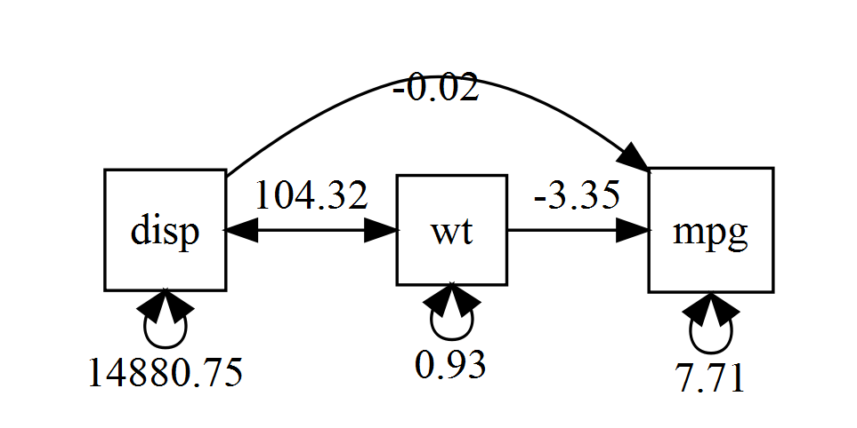
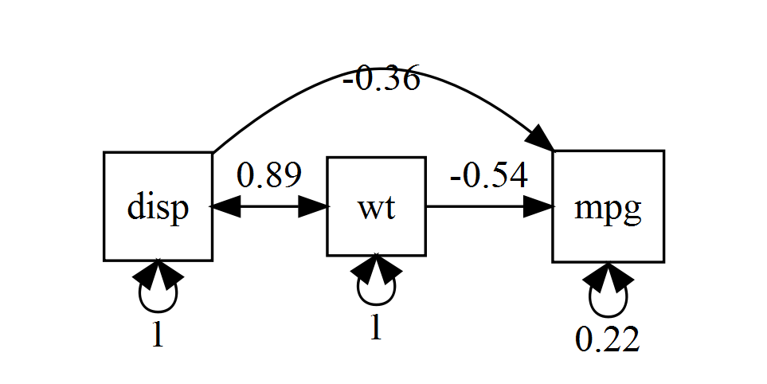

```{r, include = F}
t <- q <- 1 # Task counter
task <- function(x = t) {
  t <<- x + 1
  q <<- 1
  return(paste0("**Task ", x, ": **"))
}
qu <- function(reset = F, x = q, y = t - 1, sol = solution) {
  q <<- ifelse(reset, 1, x + 1)
  return(paste0(if(!sol) {"- "}, "**Question ", y, ".", x, ": **"))
}
library(OpenMx)
library(umx)
```

\newif\ifsol
\sol`r ifelse(solution, "true", "false")`

This week, we will familiarise ourselves further with `OpenMX` and its helper package `umx` and run and compare some models. Onwards!

&nbsp;

`r task()`Install the `umx` package.

`r task()`Open help on `umx`: Have a quick scan of the functions, look at an example or two.

`r task()`Run the function `umx_set_optimizer()`.

`r qu()`What is an optimiser?

\ifsol
```{r, include = solution}
### ANSWER ###
```

An optimiser is and algorithm used to efficiently find a minimum or maximum of a mathematical function. Here, the optimiser is used to derive the log-likelihood of models.

> **Note **This is a *helper* function: all functions beginning `umx_` are helpers.

&nbsp;

\else

> **Note **This is a *helper* function: all functions beginning `umx_` are helpers.

\fi

`r qu()`How do you see the code inside a function?

\ifsol
```{r, include = solution}
### ANSWER ###
```
Simply run the command without the `()`.

&nbsp;

\fi

`r qu()`Look at the code inside `umx_set_optimizer`.

\ifsol
```{r, include = solution, eval = F}
umx_set_optimizer


function (opt = NA, model = NULL, silent = FALSE) 
{
  if (is.na(opt)) {
    if (is.null(model)) {
      o = mxOption(NULL, "Default optimizer")
    }
    else {
      o = mxOption(model, "Default optimizer")
    }
    if (!silent) {
      quoteOptions = omxQuotes(mxAvailableOptimizers())
      message("Current Optimizer is: ", omxQuotes(o), 
        ". Options are: ", quoteOptions)
    }
    invisible(o)
  }
  else {
    if (!opt %in% mxAvailableOptimizers()) {
      stop("The Optimizer ", omxQuotes(opt), " is not legal. Legal values (from mxAvailableOptimizers() ) are:", 
        omxQuotes(mxAvailableOptimizers()))
    }
    if (is.null(model)) {
      mxOption(NULL, "Default optimizer", opt)
    }
    else {
      stop(paste0("'Default optimizer' is a global option and cannot be set on models. just say:\n", 
        "umx_set_optimizer(", omxQuotes(opt), ")"))
    }
  }
}
```

&nbsp;

\fi

`r task()`Get help on `umxRAM()`

\ifsol

&nbsp;

\fi

`r task()`Look the first simple example in `umxRAM()` help.

`r qu()`What do `wt`, `disp`, and `mpg` stand for in `mtcars`?

\ifsol
```{r, include = solution}
### ANSWER ###
```

From `?mtcars`:

-------------   ------------------------
`[, 1] mpg`	    Miles/(US) gallon
...
`[, 3] disp`	  Displacement (cu.in.)
...
`[, 6] wt`	    Weight (1000 lbs)
------------    ------------------------

&nbsp;

\fi

`r qu()`Create a `mxData` object from the relevant `mtcars` variables (`umxRAM()` can actually cope with dataframes as input but do this anyway).

\ifsol
```{r, include = solution}
### ANSWER ###

myData <- mxData(cov(mtcars[ , c(1, 3, 6)]), "cov", numObs = nrow(mtcars))
```

&nbsp;

\fi

`r qu()`Are we using the raw data or a covariance matrix?

\ifsol
```{r, include = solution}
### ANSWER ###
```

Covariance matrix.

&nbsp;

\fi

`r qu()`Build model `m1`.

\ifsol
```{r, include = solution}
### ANSWER ###

m1 <- umxRAM("tim", data = myData,
             umxPath(c("wt", "disp"), to = "mpg"),
             umxPath("wt", with = "disp"),
             umxPath(var = c("wt", "disp", "mpg")))
```

&nbsp;

\fi

`r task()`By default, once you are done, you see a compact fit summary.

`r qu()`Is this good fit?

\ifsol
```{r, include = solution}
### ANSWER ###
```
Yes! In fact, it is a perfect fit ($\chi^2(0) \approx 0$) as the model is *saturated*, AKA "just identified". Such a model has zero degrees of freedom because the **number of estimated parameters**, in this case six, **is equal to the number of known values** (three variances and three covariances).

&nbsp;

\fi

`r task()`Get a `summary()` of the model.

\ifsol
```{r, include = solution}
### ANSWER ###

summary(m1)
```

&nbsp;

\fi

`r qu()`What do the components mean?

\ifsol
```{r, include = solution}
### ANSWER ###
```

Most notably:

`free parameters` - paths we are estimating

- names of the parameters

- the estimated values

- the *SE*s of the estimates

`Model Statistics` - summary of model fit

* the rows are the model that are compared in order to produce comparative model fit indices:
    + `Model` is the model we specified using `umxRAM()`
    + `Saturated` is the, well, saturated model (see above). As you can see, in our case `Model` and `Saturated` have the same values becuase, as discussed, the model we fit is saturated.
    + `Independence` is the **worst possible** model, *i.e.,* one where we assume nothing is related to anything. In this case, it is a model, where we only estimate the variance of each variable, but no correlations or regression coefficients (hence 3 parameters).

* the columns are:
    + the number of parameters in each of the 3 models
    + Model degrees of freedom (see above)
    + the model fit in terms of $-2LL$ (log-likelihood)

`Information Criteria` - Better measures of fit

- `AIC` is the 'Akaike Information Criterion' which penalises for degrees of freedom. That means that a simpler model (with relatively more *df*s) will have a smaller value of AIC than en equally well-fitting more complex model.

- `CFI`, `TLI`, `RMSEA` are some other fit indices; we will go over these next week.

&nbsp;

\fi

`r task()`Compare with `umxSummary()`.

`r qu()`Get `umxSummary()` to show the path estimates.

\ifsol
```{r, include = solution}
### ANSWER ###

umxSummary(m1, showEstimates = "raw")
```

&nbsp;

\fi

`r task()`Get the AIC from the model.

\ifsol
```{r, include = solution}
### ANSWER ###

AIC(m1)
```

&nbsp;

\fi

`r qu()`What does AIC stand for?

\ifsol
```{r, include = solution}
### ANSWER ###
```

"Akaike Information Criterion". For more info see David Kenny's excellent (well, content-wise) page on [fit indices](http://davidakenny.net/cm/fit.htm#AIC).

&nbsp;

\fi

`r task()`Plot the output.

\ifsol
```{r, include = solution, eval = F}
### ANSWER ###

plot(m1)
```

\

&nbsp;

\fi

`r task()`Get `plot()` to draw a standardised model.

\ifsol
```{r, include = solution, eval = F}
### ANSWER ###

plot(m1, std = T)
```

\

&nbsp;

\fi

`r task()`Why aren't there any means in the plot?

\ifsol
```{r, include = solution}
### ANSWER ###
```
Because we only provided a variance-covariance matrix to `umxRAM()` without specifying a vector of means. Since var-cov matrix reduces the information in the data, there is no way to reconstruct the means of the variables from the matrix.

&nbsp;

\fi

`r task()`Draw a model of the hypothesis in your thesis.

`r qu()`Do all the paths in your drawing have arrow heads on at least one end?

`r qu()`Why must we always draw the arrow heads on our paths (not just leave them blank)?

\ifsol
```{r, include = solution}
### ANSWER ###
```

Because we need to tell `R` the direction of the relationship between the variables (*e.g.,* A predicts B, B predicts A, A and B are correlated, A loads on B).

&nbsp;

\fi

`r qu()`Are all the circles on your model connected to squares?

\ifsol
```{r, include = solution}
### ANSWER ###
```
Please say yes!

&nbsp;

\fi

`r qu()`Is everything you are interested in measured multiple ways, so it can be a latent variable?

\ifsol
```{r, include = solution}
### ANSWER ###
```
Remember that for a measurement model to be identified, you need at least two observed variables per latent variable (assuming several things discussed in a later lecture).

&nbsp;

\fi

`r qu()`Did you draw the expected residuals and covariance?

\ifsol
```{r, include = solution}
### ANSWER ###
```
That is very nice!

&nbsp;

\fi

`r task()`Build a new model `m2`.

`r qu()`Make it like the one in Question 4.4, but leave out the path from `wt` to `mpg`.

\ifsol
```{r, include = solution}
### ANSWER ###

m2 = umxRAM("tim2", data = myData,
            umxPath("disp", to = "mpg"),
            umxPath("wt", with = "disp"),
            umxPath(var = c("wt", "disp", "mpg")))
```

&nbsp;

\fi

`r qu()`Did it run?

\ifsol
```{r, include = solution}
### ANSWER ###
```
It should have!

&nbsp;

\fi

`r task()`umxCompare `m1` and `m2`

\ifsol
```{r, include = solution, eval = F}
### ANSWER ###

umxCompare(m1, m2)

```

```{r, include = F}
x <- umxCompare(m1, m2, report = "2")
names(x)[3:4] <- c("delta -2LL", "delta df")

x
```

```{r, include = solution, echo = F}
x
```

&nbsp;

\fi

`r qu()`How did `m2` fit the data compared to `m1`? How do you know?

\ifsol
```{r, include = solution}
### ANSWER ###
```
The fit was worse, since the *p*-value of the likelihood ratio test is significant and there is a decrease in likelihood in `m2` compared to `m1`. (or an *increase* in $-2LL$ of `r round(x[2,3], 2)`). Also, given that `m1` is a saturated model with a perfect fit, any non-saturated model will fit worse than `m1` (though not necessarily statisctically significantly worse!).

&nbsp;

\fi

`r qu()`What happened to AIC?

\ifsol
```{r, include = solution}
### ANSWER ###
```
It has increased by `r round(diff(x[,6]), 2)`, reflecting the worse fit. (Remember, lower AIC is better!)

&nbsp;

\fi

`r task()`Visit the `OpenMx` [home page](http://openmx.ssri.psu.edu).

`r task()`Build and run the 1-factor CFA model on the home page.

\ifsol
```{r, include = solution}
### ANSWER ###

data(demoOneFactor)
manifests <- names(demoOneFactor)
latents <- c("G")
factorModel <- mxModel("One Factor",
                       type = "RAM",
                       manifestVars = manifests,
                       latentVars = latents,
                       mxPath(from = latents, to = manifests, values = 0.8),
                       mxPath(from = manifests, arrows = 2, values = 1),
                       mxPath(from = latents, arrows = 2,
                              free = FALSE, values = 1.0),
                       mxData(cov(demoOneFactor), type = "cov", numObs = 500))

summary(factorModelFit <- mxRun(factorModel))
```

```{r, echo = F}
x <- summary(factorModelFit)
```

As mentioned above, every unsaturated model will have a worse fit to the data than the saturated model, however the difference need not be significant. That is exactly the case here: the model's $-2LL$ was higher by `r round(x$Chi, 2)` but this change had an associated *p*-value of `r sub("^0", "", round(x$p, 3))`.

&nbsp;

\fi

`r qu()`Try leaving out a path from *g* to one of the items.

\ifsol
```{r, include = solution}
### ANSWER ###

m3 <- mxModel("One Factor",
              type = "RAM",
              manifestVars = manifests,
              latentVars = latents,
              mxPath(from = latents, to = manifests[-1], values = 0.8),
              mxPath(from = manifests, arrows = 2, values = 1),
              mxPath(from = latents, arrows = 2,
                     free = FALSE, values = 1.0),
              mxData(cov(demoOneFactor), type = "cov", numObs = 500))

summary(m3Fit <- mxRun(m3))
```

&nbsp;

\fi

`r qu()`Does the model even run?

\ifsol
```{r, include = solution}
### ANSWER ###
```

Again, it should...

&nbsp;

\fi

`r qu()`Does it fit worse or better? How would we know?

\ifsol
```{r, include = solution}
### ANSWER ###

# you can use either
mxCompare(factorModelFit, m3Fit)
```

```{r, include = solution, eval = F}
# or
umxCompare(factorModelFit, m3Fit)
```

```{r, include = F}
x <- umxCompare(factorModelFit, m3Fit, report = "2")
names(x)[3:4] <- c("delta -2LL", "delta df")

x
```

```{r, include = solution, echo = F}
x
```

The fit of this new model is singificantly worse that the original one, $\Delta\chi^2(1) = `r round(x[2, 3], 2)`,\ p `r sub("0\\.", ".", x[2, 5])`$.

&nbsp;

\fi

`r task()`Visit the `umx` [home page](http://tbates.github.io)

`r qu()`For homework, try some other example models.

## Next week, we will discuss model fit and model comparison in more detail.

## See you!

