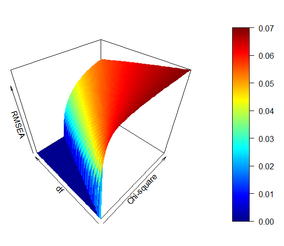
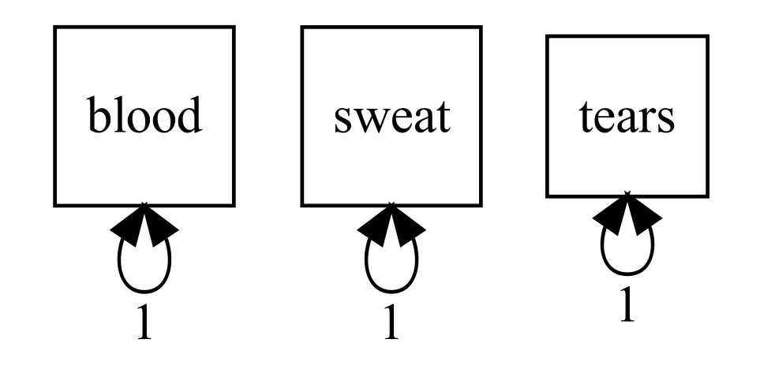
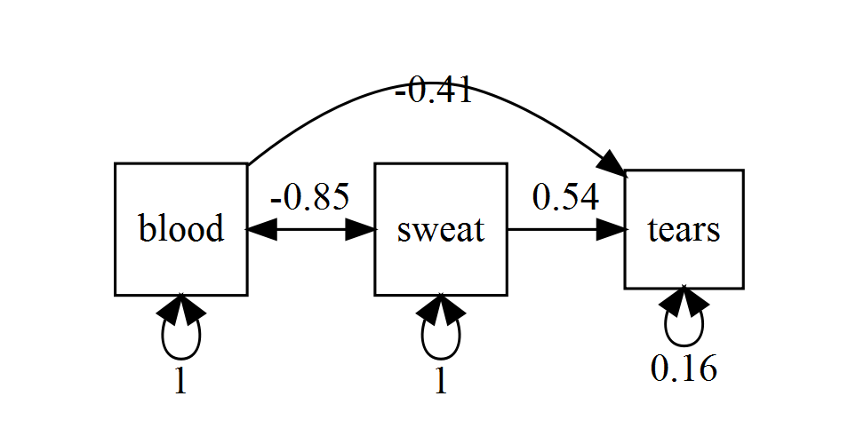

```{r, include = F}
t <- q <- 1 # Task counter
task <- function(x = t) {
  t <<- x + 1
  q <<- 1
  return(paste0("**Task ", x, ": **"))
}
qu <- function(reset = F, x = q, y = t - 1, sol = solution) {
  q <<- ifelse(reset, 1, x + 1)
  return(paste0(if(!sol) {"- "}, "**Question ", y, ".", x, ": **"))
}
library(OpenMx)
library(umx)
```

\newif\ifsol
\sol`r ifelse(solution, "true", "false")`

As promised last week, in this lab, we will delve deeper into fit indices and model comparison. So, without further ado:

`r task()`Run the first example in `umxRAM()` documentation, just like you did last week.

```{r, include = solution}
### ANSWER ###

myData <- mxData(cov(mtcars[ , c(1, 3, 6)]), "cov", numObs = nrow(mtcars))

m1 <- umxRAM("tim", data = myData,
             umxPath(c("wt", "disp"), to = "mpg"),
             umxPath("wt", with = "disp"),
             umxPath(var = c("wt", "disp", "mpg")))
```

`r task()`Get a summary of the model using the `umx` helper function.

```{r, include = solution}
### ANSWER ###

umxSummary(m1)
```

`r qu()`Does it fit well?

\ifsol

```{r, include = solution}
### ANSWER ###
```

As discussed last week, yes, this is a perfect fit because the model is saturated.

&nbsp;

\fi

`r task()`Get a `summary()` of the model.

\ifsol

```{r, include = solution}
### ANSWER ###

summary(m1)
```

&nbsp;

\fi

`r qu()`What fit statistics can you see?


\ifsol
```{r, include = solution}
### ANSWER ###
```

- *$\chi^2$* (Chi-squared) measure of fit based on $-2LL$
- *AIC*, [Akaike Information Criterion](https://en.wikipedia.org/wiki/Akaike_information_criterion) (comparative model fit penalised for degrees of freedom)
- *BIC*, [Bayes Information Criterion](https://en.wikipedia.org/wiki/Bayesian_information_criterion)
- *CFI*, Comparative fit Index
- *TLI*, Tucker-Lewis index
- *RMSEA*, Root mean square error of approximation, some call it 'Ramsey'

&nbsp;

\fi

`r task()`Inspect the model fit.

`r qu()`Is the fit of the model good according to RMSEA and TLI?

\ifsol

```{r, include = solution}
### ANSWER ###
```

Yes, according to the conventional thresholds (see below), the model fits very well.

&nbsp;

\fi

`r qu()`What are conventional criteria for good fit?

\ifsol

```{r, include = solution}
### ANSWER ###
```

RMSEA $\leq .05$

TLI $\geq .95$

&nbsp;

\fi

`r qu()`Can you tell from the AIC if fit is good?

\ifsol

```{r, include = solution}
### ANSWER ###
```

No, AIC is a comparative measure so it can only tell you whether your model fits better or worse than some other model. The value of AIC in and of itself does not indicate whether or not the fit is good.

&nbsp;

\fi

`r task()`Look up the formula for AIC in the `summary.MxModel()` documentation.

`r qu()`Explain this to a lab-mate.

\ifsol

```{r, include = solution}
### ANSWER ###
```

The formula is

$$AIC = -2LL + 2\times N_{param}$$
, where $-2LL$ is the model fit in terms of $-2 \times$log-likelihood and $N_{param}$ is the number of free parameters. Because we're adding $2\times N_{param}$, we are penalising the given model for complexity (more complex models estimate more free parameters). In the case of `m1`, the AIC value is
`AIC(m1)` = `summary(m1)$Minus2LogLikelihood + 2 * summary(m1)$estimatedParameters` = `r summary(m1)$Minus2LogLikelihood + 2 * summary(m1)$estimatedParameters`.

&nbsp;

\fi

`r task()`Look up the formula for RMSEA on the internet.

\ifsol

```{r, include = solution}
### ANSWER ###
```

The formula is

$$\frac{\sqrt{\chi^2-df}}{\sqrt{df\times (N-1)}}$$

&nbsp;

\fi

`r qu()`What are the key parameters?

\ifsol

```{r, include = solution}
### ANSWER ###
```

- $\chi^2$ is the difference in $-2LL$ of the model versus the saturated model
- $df$ are the model degrees of freedom
- $N$ is the sample size.

&nbsp;

\fi

`r qu()`What makes RMSEA get smaller?

\ifsol

```{r, include = solution}
### ANSWER ###
```

RMSEA gets smaller as:

a. the numerator ($\sqrt{\chi^2-df}$) gets smaller, which happents as
   a.1. the fit of the model (at a given level of complexity) improves, *i.e.,* the $\chi^2$ gets smaller, or
   a.2. the model gets simpler (at a given level of fit), *i.e.,* $df$ gets bigger.
b. the denominator ($\sqrt{df\times (N-1)}$) gets bigger, which happens as... see below.


&nbsp;

\fi

`r qu()`Plug in some values and see...
 
\ifsol
```{r, include = solution}
### ANSWER ###

# You can use a functun such as this to play with different values
rmsea <- function(chisq, df, n) {
  return(sqrt(chisq - df)/sqrt(chisq * (n - 1)))
}

# e.g.
rmsea(25.43, 10, 300)
```

Figure 1 shows a visual representation of the relationship between $\chi^2$ (between 1 and 50) and model $df$ (1 - 20) on the one hand and RMSEA on the other. The flat blue section reflects the fact that if $df>\chi^2$, RMSEA is set to be zero, instead of negative.



&nbsp;

\fi

`r qu()`What makes the denominator get bigger?

\ifsol

```{r, include = solution}
### ANSWER ###
```
Two things:

- larger sample size ($N$)
- simpler model (more $df$)

&nbsp;

\fi

`r task()`get the mxRefModels for your model `m1`

\ifsol

```{r, include = solution, eval = F}
### ANSWER ###

ref <- mxRefModels(m1)
```

`[omitting printout to save space]`

&nbsp;

\fi

`r qu()`What does mxRefModels return?

\ifsol

```{r, include = solution}
### ANSWER ###
```

A list of two models: `Saturated` (the best possible) and `Independence` (the worst possible).

&nbsp;

\fi

`r qu()`What are these two reference models?

\ifsol

```{r, include = solution}
### ANSWER ###
```

`Saturated` model is a model with all possible paths included (all possible parameters estimated, in our case six). Therefore if has zero degrees of freedom. This model will reproduce the orginal variance-covariance matrix of the data perfectly and so has a perfect fit. Unfortunately, that also makes it useless for hypothesis testing.

`Independence` model is the null model. It assumes no relationships between the variables (*i.e.,* all the covariances are fixed to 0) and only estimates the variances of the variables provided (in this case 3 variables, hence 3 parameters and $6 - 3 = 3$ degrees of freedom).

&nbsp;

\fi

`r qu()`Why are they useful?

\ifsol

```{r, include = solution}
### ANSWER ###
```

They are used to derive some of the fit indices. For instance, the Tucker-Lewis Index is calculated as:

$$TLI = \frac{Fit_{null\ model} - Fit_{my\ model}}{Fit_{null\ model} - 1}$$

, where $Fit_x = \frac{\chi^2_x}{df_x}$.

&nbsp;

\fi

`r task()`Run the example model `m1` given in `?mxRefModels`.

\ifsol

```{r, include = solution}
### ANSWER ###

data(demoOneFactor)
manifests <- names(demoOneFactor)
latents <- c("G")

# A raw-data example where using mxRefModels adds fit indices
## Not run: 
m1 <- mxModel("OneFactor", type = "RAM",
    manifestVars = manifests, latentVars = latents,
    mxPath(latents, to = manifests, values = diag(var(demoOneFactor))*.2),
    mxPath(manifests, arrows = 2, values = diag(var(demoOneFactor))*.8),
    mxPath(latents, arrows = 2, free = FALSE, values = 1),
    mxPath("one", to = latents, free = FALSE, values = 0),
    mxPath("one", to = manifests, values = 0),
    mxData(demoOneFactor, type = "raw")
)
m1 <- mxRun(m1)
```

&nbsp;

\fi

`r qu()`Produce `summary()` of `m1`.

\ifsol

```{r, include = solution}
### ANSWER ###

summary(m1)
```

&nbsp;

\fi

`r qu()`No get another summary, this time providing `mxRefModels()` of the model to the `refModels` argument of `summary()`.

\ifsol

```{r, include = solution}
### ANSWER ###

summary(m1, refModels = mxRefModels(m1, run = TRUE))
```

&nbsp;

\fi

`r qu()`What is the difference?

\ifsol

```{r, include = solution}
### ANSWER ###
```

First, in the `Model Statistics` section, we can now see the $-2LL$ values for the reference models.

Next, the $\chi^2$ test became available. This is a likelihood ratio test (think back to mixed-effects models) comparing our model `m1` to the saturated model. It is not significant ($p \geq .05$), meaning that `m1` does not fix significantly *worse* than the perfectly fitting model. Notice that the value of the $\chi^2$ statistic corresponds to $-2LL_{m1}- -2LL_{saturated}$.

Finally, some mode fit indices now appear in the summary, namely CFI, TLI, and RMSEA. In addition, the latter comes with its own confidence interval and the probability of it being less than or equal to .05.

&nbsp;

\fi

`r task()`Draw an independence model for three variables.

\ifsol

```{r, eval = F, echo = F}
### ANSWER ###

dimnames(myData@observed) <- list(c("blood", "sweat", "tears"),
                                  c("blood", "sweat", "tears"))

m_ind <- umxRAM("BST_ind", data = myData,
                independent = T,
                umxPath(var = c("blood", "sweat", "tears")))

m_sat <- umxRAM("BST_sat", data = myData,
                umxPath(c("blood", "sweat"), to = "tears"),
                umxPath("blood", with = "sweat"),
                umxPath(var = c("blood", "sweat", "tears")))
```

\
&nbsp;

\fi

`r task()`Make it into saturated model for three variables.

\ifsol

\

&nbsp;

\fi

`r task()`Open http://davidakenny.net/cm/fit.htm

`r qu()`Try and figure out why the new statistics became available when the independence and saturated models became available.

\ifsol

```{r, include = solution}
### ANSWER ###
```

Simply put, they are needed! For example, the likelihood ratio test requires the $-2LL$ of the saturated model and the TLI needs the $-2LL$ of the null (independence) model.

&nbsp;

\fi

`r task()`Take turns explaining to a lab-mate what optimisation does

# That's it for this week. Well done!

## Useful links

[David Kenny's page](http://davidakenny.net/cm/fit.htm)

[`umx` home page](http://tbates.github.io)

[`OpenMx` home page](http://openmx.ssri.psu.edu)
