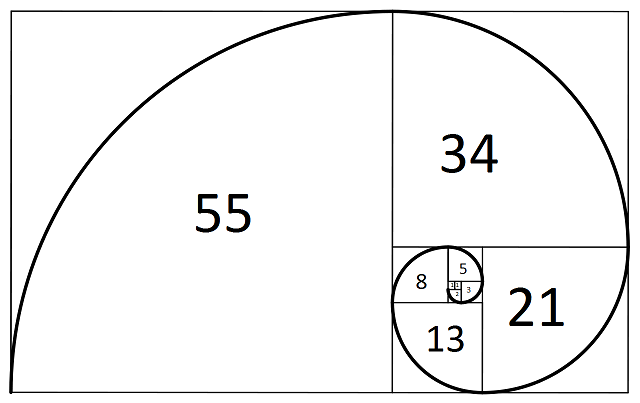
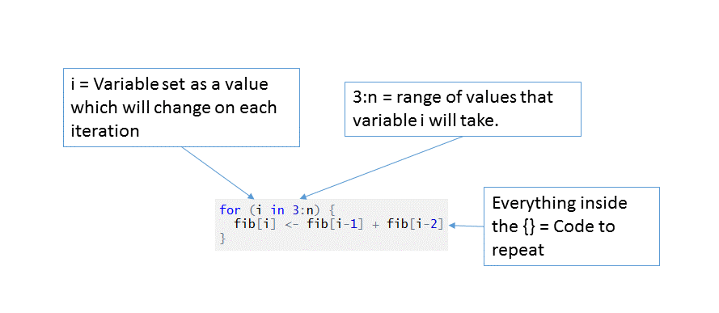

```{r, include = F}
t <- 1 # Task counter
task <- function(x = t) {
  t <<- x + 1
  return(paste0("**Task ", x, ": **"))
}
```
# R skills: Writing functions and useful functions
The primary purpose of this lab is to teach you some more advanced R skills. So far we have mainly considered how to use R for simple tasks on limited numbers of variables. However, when we analyse real datasets, we often want to repeat certain analyses on lots of variables. Today we will look at some tools which help us do this easily without hundreds of lines of code.

We have also made use of a good number of the functions and packages which already exist in R.  But on occasions, we may have a specific need for which we cannot find an existing function. When this happens, it can sometimes be time-efficient to construct our own function to do the task. And this is where we will start the lab, writing functions.

# Writing Functions
## Elements of a function
In generic form, a function looks something like this:

```{r eval = FALSE}
function.name <- function(Argument1, Argument2 = 1) {
  Action1
  return(value)
}
```

So what are all these elements? Let's run through them;

- *function.name*: This is pretty self-explanatory - it is the name we give to our function and the name you would use to call the function once it is written.

- *function*: This comes immediately after the assignment operator, to tell R we are about to write a new function.

- *Argument1*: The arguments which appear in parentheses are the information you will give R when using the function. You have seen the use of multiple arguments when, for example, we have been randomly generating data. Take this familiar example:
```{r eval = FALSE}
dbinom(x = 6, size = 15, prob = 0.25) # Hopefully you recognise this from last week
```
We provide values for the three arguments _x, size,_ and _prob_ and the function uses these values to produce our result. When we supply alternative values, the result changes.

- *Argument2 = 1*: The difference here between `Argument1` and `Argument2` is in the latter case, we have added = 1. So what does this mean? If you have read Navarro on function writing (p.264-266. version 0.5) you will already know. When we specify a value for an argument, this will be the default value used within the function **IF** no value is given when the function is called. An example of this appears below.

- {}: The curly brackets are perhaps the most crucial bit in the code. These mark the start and finish of the code which will actually become the function. R will action everything placed within the curly brackets in the order in which it appears.

- *Action1* etc: This is where we place the things we want our function to do. The only thing that limits us here are R's capabilities (which are pretty high!) - We can also call other functions within our function if we wish!

- *return(value)*: The return statement tells R what we would like the output of our function to be. R will compute all the steps within the function internally, that is, the calculations will not show in the console. R will only give us as output what we ask for. If we do not ask R to return anything, we will not receive anything. We place into the parentheses the exact object we would like as output. It is also important to note that variables created within a function do not appear in the workspace environment unless they are 'returned'. This feature has a number of consequences to be aware of; a) Anything created inside a function will not be accessible to you if they are not part of the return statement, and b) This means that a function can be a useful tool even if you don't need to repeat a task over and over but want to maintain a tidy workspace - Think of a task where you might need to create numerous temporary variables to get to your end goal. 

# Making our own function

## Super simple function
So let's start nice and simple. Let's create a function which will create a difference score from two variables:

```{r}
# Here we create our super simple function
calc.difference = function(x, y){
  z = x - y
  return(z)
}

# then we create a little bit of data
vec1 <- rnorm(n = 10, mean = 20, sd = 4) # draw 10 values from normal distribution
vec2 <- rnorm(n = 10, mean = 10, sd = 2)

# take a look
vec1
vec2

# and run it through the function
calc.difference(vec1, vec2)
```

`r task()`Why don't you play around with this function a little bit. Try modifying this function so that it gives you the mean value of the differences instead of the actual difference values it currently provides. 

```{r, include = solution}
#### ANSWER ####

# Just add a call to the mean function in the return statement
calc.difference.mean <- function(x, y){
  z <- x - y
  return(mean(z))
}
```

## A function to show central limit theorem in action
In the lecture we considered central limit theorem. So let's build a function to help us demonstrate central limit theorem in action.

## Step 1. 
Create a "population" with any distribution you like. Remember, central limit theorem should be true for sampled means irrespective of the original distribution.

```{r}
pop <- runif(1000, min = 0, max = 10)
```

## Step 2. 
Now let's take a quick look at the population (here, it's uniform) we just created:

``` {r, fig.height = 5}
hist(pop)
summary(pop)
```

# Step 3. 
`r task()`Write a function called **samp.mean** to take a sample of 'n' observations from the population *(with replacement)* and return the mean. We have used `sample` on a number of occasions ('?sample' might be of help), and remember we can get the mean simply by using `mean`.

``` {r, include = solution}
#### ANSWER ####

samp.mean <- function(n) {
  samp <- sample(pop, size = n, replace = T)
  return(mean(samp))
}
```

## Step 4. 
Once you have written your function, it is important to test that it works. We can look at the output it provides for different values of n:

``` {r}
samp.mean(5)
samp.mean(100)
```

So we now have a function that produces individual means for single samples from our population. But to demonstrate central limit theorem, we need to get lots of means and plot them. So...

## Step 5. 
Let's use some other R features/functions to create a vector of 100 sample means (n = 10, for example). A very useful function for this is `replicate()`

``` {r}
vec <- replicate(100, samp.mean(10))
```

And we can plot this vector in the same way as we have been making plots in previous labs.

``` {r}
hist(vec, main = "Sample Means: n = 10")
#or using ggplot
library(ggplot2)
qplot(vec, binwidth = 0.5) + ggtitle("Sample Means: n = 10")
```

## Step 6. 
`r task()`So now comes the next challenge. Can you integrate these commands into a single function **(call it samp.mean.hist)** which will calculate any number of means (but set the default to 100) from samples of size n taken from the population and output a histogram?

*Tip: when setting the title of the histogram the function creates look up the function paste()*

``` {r, include = solution}
#### ANSWER ####

samp.mean.hist <- function(n, n.samples = 100) {
  vec <- replicate(n.samples, samp.mean(n))
  hist(vec, main = paste('Sample means: n = ', n, sep = ''))
}
```

Again, test if it works:

``` {r}
samp.mean.hist(3)
samp.mean.hist(10)
# Test that we can override the default number of samples
samp.mean.hist(n = 50, n.samples = 1000)
```

`r task()`Once you have an operational function, change the distribution of `pop` to something different - and try your function again. Perhaps try 'rnorm()' to define a normally distributed population or see `?Distributions` to pick an alternative. Or even try `sample()' with the prob argument set to define your own. The point is to use your functions to show how the estimates of the mean one obtains from samples of the population differs with varying sample sizes.

``` {r, include = solution}
#### ANSWER ####

# No predefined solution. As long as pop has been changed to an 
# alternatively distributed variable.
```


# Loops

Often we have a task that we want R to complete multiple times and in fact you have encountered this already in several of the lab questions/exercises you have completed. Where we have a task that needs repeating multiple times but with different inputs/values we can use loops. Let's look at a *for* loop in R with a toy example of calculating the Fibonacci sequence up to a given value. The Fibonacci sequence is a sequence of numbers where the next value is the sum of the two numbers preceding it. Take a look:



Notice in the figure above the numbers inside the squares is the length of the sides. Start from the smallest two **(1, 1)** and note how each square of increasing size is the length of the previous two added together. This figure illustrates how the fibonacci sequence can be used to create beautiful spirals that occur all around us in nature. Below is a function which uses a for-loop to calculate the Fibonacci sequence up to a specified value. Take a look initially at the code and then consult the explanation below.

```{r}
fib.func <- function(n = 10) {
  fib <- numeric() # initialise a vector to hold our values
  fib[1:2] <- c(1, 1) # manually set the first two values
  
  for (i in 3:n) {
    fib[i] <- fib[i-1] + fib[i-2]
  }
  
  return(fib)
}

# Now call the function with desired value of n
fib.func(20)
```

Here we have used some R skills you have developed (writing functions and indexing) and introduced a new tool - the for loop. 



What happens is that the code between the curly brackets **{}** is evaluated for every value of *i* we feed the loop. We fed the loop the range *3:n* and in our example we called the function with *n = 20* and therefore evaluating `3:20` in the R terminal shows you the range of values i will take. Therefore, on the first iteration the code being executed is `fib[3] <- fib[2] + fib[1]` which adds a third value to the *fib* vector which is the sum of the previous two values. The range of values to iterate over can be any number of things. 

In this example we need a sequential range of values as the calculation of the nth value of Fibonacci sequence requires we have the previous two values. If we needed a loop for specific values rather than a sequential range we can set those values e.g. 'i in c(2, 6, 26, 35)'. More likely, we may have a vector that holds values that we want to iterate over e.g. 'i in userID' - For each iteration the value of i will move on to the next value in userID. 

`r task()`Recall the coin toss plots you created last week (see page 6 of the lab 3 solutions). Now that we know about loops try to make use of a for loop to complete the coin toss plots in less code. 

*Tip: Look at what parts of the code repeat and what values change for each plot. What do you need __i__ to be in your loop?*

``` {r, include = solution}
#### ANSWER ####

n.values <- c(6, 10, 20, 100, 1000, 10000)
par(mfrow = c(2, 3))
for (i in n.values) {
  plot(as.factor(rbinom(i, size = 1, prob = 0.5)),
       main = paste("N = ", i, sep = ""))
  box(bty = "L")
}
```

# `sapply`: another useful function

Often in R we can achieve the repetition of a task in a simpler and faster (computationally) method than the for loop. You may now be cursing me for making you learn about the for loop and then telling you there are often better ways but allow me to explain. Firstly, the for loop is an example of a method of controlling the flow of a program/script that you will find in just about all programming languages, and therefore it is useful you know how to use them to solve problems as it is a method that isn't specific to R. Secondly, a for loop is often easier to understand and easier to demonstrate the process of iterating over a code block while varying a parameter. And thirdly, despite the usefulness of the functions outlined below there will be times where a for loop is necessary to achieve a given task. 

The `apply()` family of functions provide an alternative to for loops. We have seen one of these above - `replicate()`, another one we will look at is `sapply()`.

`sapply()`: we run a specified function across a set of variables or values. So We need to give `sapply()` a couple of pieces of information. Firstly, we need to give it some values or vectors, and then we need to give it some function or action to do on those values. Here are a couple of examples:

```{r}
res <- sapply(seq(1, 100, 1), sqrt)
head(res)
```

Or how about; 

``` {r}
x <- 1:10
y <- seq(10, 100, 10)
data <- as.data.frame(cbind(x, y))
sapply(data, mean)
```

`r task()`What do you think `seq()` is doing here?

``` {r, include = solution, eval = F}
#### ANSWER ####

The three arguments to seq() are from, to, and by. 
So the command seq(10, 100, 10) is requesting a sequence that begins at 10, goes to 100, 
and does so in increments of 10. Thus in this case it creates a vector of length 10 
which matches the length of x above. 
```

Create some vectors of data and combine them into a data frame. Do some simple actions on the vectors such as squaring the values, or adding a constant to them.

## Some examples of sapply in action
We could use `sapply` along with our function we created above to plot histograms for specific n's (analogous task to producing the coin toss plots using loops earlier).

``` {r}
par(mfrow = c(2, 2))
sapply(c(3, 5, 10, 25), samp.mean.hist)
```

Here `sapply` has taken the values we provided; **3, 5, 10, and 25**, and run our function `samp.mean.hist` with these values as the `n` inputs. Remember we gave this function a default for the number of samples so we don't have to worry about specifying this. If wanted to provide that value rather than accepting the default we could have done (note: I chose **n.samples** as the argument name, you will have likely chosen something different:

``` {r}
par(mfrow = c(2, 2))
sapply(c(3, 5, 10, 25), n.samples = 10, samp.mean.hist)
```

# Some additional exercises
For those of you who are whizzing through the labs, here are some tricky questions which should keep you busy. **Note**: These questions, quite deliberately, have no guidance. They are advanced questions which will require you to go exploring on the web and work out how to do certain things.

1. Produce a density plot of the standard normal distribution (mean of 0 and standard deviation of 1). Fill in the area under the curve which is +/- 1SD from the mean. (see the example on the "Plotting Critical Region" slides from lecture 4)

``` {r, include = solution}
#### ANSWER ####

x.coord <- c(-1, seq(-1, 1, 0.01), 1) 
y.coord <- c(0, dnorm(seq(-1, 1, 0.01)), 0) 
curve(dnorm(x, 0, 1), xlim = c(-4, 4), main = 'Standard Normal',
      xlab = 'Z-Score', ylab = "", axes = FALSE) 
# or with plot() - plot(seq(-4, 4, 0.01), dnorm(seq(-4, 4, 0.01), 0, 1), type = "l")
polygon(x.coord, y.coord, col = 'red')
# polygon takes a series of points and joins them up - as though 
# doing a dot-to-dot puzzle you may be familiar with from childhood! 
# After it reaches the final point you provide it joins that to the 
# initial point you  provided and fills in the enclosed space with 
# the specified colour

# Cosmetic
area <- pnorm(1, 0, 1) - pnorm(-1, 0, 1) # calculate area under curve for interval
result <- paste("P(+/-1SD) =", signif(area, digits = 3))
mtext(result, 3)
axis(1, at = seq(-4, 4, 1), pos = 0)
axis(2, at = seq(0, 0.5, .1))
abline(v = -1, lwd = 2)
abline(v = 1, lwd = 2)
```

2. Consider the simulation and plots in Navarro pages 316-318 (version 0.5). Reproduce these plots. Read the caption for the figure (10.10, page 318) as Navarro outlines the process. These plots show: 

a. The sample mean is an unbiased estimator of the population mean and
b. The sample SD is a biased estimator or the population SD.

``` {r, include = solution}
#### ANSWER ####

samp.sizes <- 1:10
#function to generate data for each sample size 
# and return mean/sd
msd <- function(x) {
  t <- matrix(rnorm(10000 * x, 100, 15), nrow = x)
  stats <- apply(t, 2, function(z) c(mean(z), sd(z)))
  return(apply(stats, 1, mean))
}
# call that function for each sample size
data <- sapply(samp.sizes, msd)

# Plot the data
par(mfrow = c(1, 2))
plot(samp.sizes, data[1, ], type = "b", col = "blue", pch = 16, ylim = c(85, 115), 
     xlab = "Sample Size", ylab = "Average Sample Mean")
abline(h = 100, lty = 2)
# can recode the first sd to be 0 rather than NA to get the exact plot 
# Navarro produces.
data[2, 1] <- 0
plot(samp.sizes, data[2, ], type = "b", col = "blue", pch = 16, ylim = c(0, 18), 
     xlab = "Sample Size", ylab = "Average Sample Standard Deviation")
abline(h = 15, lty = 2)
```
